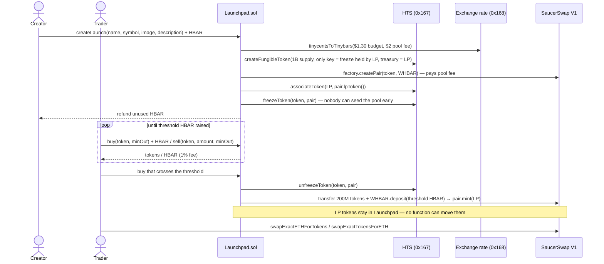
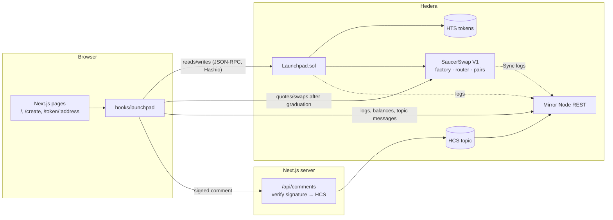

# HBAR Launchpad — a Scaffold-HBAR template

Fair-launch tokens on Hedera: mint a fixed-supply **HTS** token, sell it on a **bonding curve**, and when the curve fills, **graduate** it into a **SaucerSwap** pool whose liquidity is locked forever. Trades are charted and listed straight from the **mirror node**, and every token gets a wallet-signed comment thread on **HCS**.

```bash
npm create scaffold-hbar@latest -- --template nickthelegend/scaffold-hbar-launchpad
```

| | |
|---|---|
| **Live demo** | [hbar-launchpad-wheat.vercel.app](https://hbar-launchpad-wheat.vercel.app) (Hedera testnet) |
| **Demo video** | [watch (72 s)](https://hbar-launchpad-demo.vercel.app) · [mp4](https://hbar-launchpad-demo.vercel.app/hbar-launchpad-demo.mp4) |
| **Hedera services** | HTS (contract-created token, freeze key as an anti-sniping guard) · Exchange Rate system contract · HIP-719 association · HCS · Mirror Node REST |
| **Ecosystem integration** | SaucerSwap V1: pool creation, liquidity seeding and locking, post-graduation swaps and quotes |
| **Stack** | Foundry · Next.js App Router · RainbowKit/wagmi/viem · Yarn workspaces · Node ≥ 20.19 |
| **Live on testnet** | Launchpads [`0.0.10844301`](https://hashscan.io/testnet/contract/0.0.10844301) (25 HBAR, shared) and [`0.0.10844300`](https://hashscan.io/testnet/contract/0.0.10844300) (100 HBAR) · graduated tokens HCAT [`0.0.10844336`](https://hashscan.io/testnet/token/0.0.10844336), HOUND [`0.0.10844376`](https://hashscan.io/testnet/token/0.0.10844376) · HCS topic [`0.0.10830947`](https://hashscan.io/testnet/topic/0.0.10830947) · 40+ real transactions in [Testnet proof](#testnet-proof) |
| **Tested against** | the real SaucerSwap V1 contracts on a Hedera testnet fork: no protocol mocks |

---

## Contents

1. [Why this template](#why-this-template)
2. [Quick start](#quick-start)
3. [How it works](#how-it-works)
4. [Architecture](#architecture)
5. [Project structure](#project-structure)
6. [Configuration](#configuration)
7. [Deploy your own](#deploy-your-own)
8. [Testing](#testing)
9. [Testnet proof](#testnet-proof)
10. [Hedera gotchas this template handles](#hedera-gotchas-this-template-handles)
11. [Customising](#customising)
12. [Security considerations](#security-considerations)
13. [AI-assisted development](#ai-assisted-development)

---

## Why this template

A token launchpad is one of the most common things people build on any chain. On Hedera, building one well means stitching together pieces that are each easy to get wrong:

- creating an HTS token **from a contract**, paying the creation fee in HBAR, and giving up every admin key so holders can trust the supply;
- pricing a curve correctly when HBAR has **8 decimals inside the EVM but 18 over JSON-RPC**;
- dealing with **token association** for buyers;
- paying SaucerSwap's pool-creation fee, which is set **in USD** and must be converted on-chain;
- associating the launchpad with an **LP token that does not exist yet**, so it can hold (and lock) it;
- indexing trades without running an indexer.

This template does all of that, with tests, and a UI you can ship. Swap the branding and the curve parameters, and you have a product.

## Quick start

**Prerequisites**

| Tool | Version | Notes |
|---|---|---|
| Node.js | ≥ 20.19 (or ≥ 22.12) | Vitest 3 / Vite 7 need `require(esm)` |
| Yarn | via Corepack | `corepack enable` |
| Foundry | **1.7.x** (1.8+ breaks Hashio forks) | `curl -L https://foundry.paradigm.xyz \| bash && foundryup -i v1.7.1` |
| Git | any | `user.name` / `user.email` set (the CLI makes the first commit) |
| An EVM wallet on Hedera testnet | — | MetaMask, HashPack (EVM), Rabby… with testnet HBAR from the [portal faucet](https://portal.hedera.com/faucet) |

**1. Scaffold and run**

```bash
npm create scaffold-hbar@latest -- --template nickthelegend/scaffold-hbar-launchpad
cd my-hedera-dapp
yarn next:dev
```

Open http://localhost:3000. The frontend ships wired to the shared testnet Launchpad recorded in `packages/nextjs/contracts/deployedContracts.ts`, so you can launch, trade and graduate tokens immediately, without deploying anything. The shared deployment graduates at **25 HBAR**, so the whole lifecycle fits in a few faucet drips; it already holds graduated and in-progress tokens to explore. Your own deployments default to 100 HBAR.

**2. Launch a token.** Go to **Create**, enter a name and symbol and confirm. Launching costs about $3 in HBAR (HTS token creation plus SaucerSwap's $2 pool fee); the exact amount is quoted on the page and any excess is refunded.

**3. Trade it.** Buy and sell on the token page. The progress bar fills as HBAR is raised; the buy that crosses the threshold moves liquidity into SaucerSwap and the page switches to a SaucerSwap trade panel.

## How it works

### Lifecycle



### Supply and pricing

Every launch mints **1,000,000,000** tokens (8 decimals) to the Launchpad:

- **800M** are sold on the bonding curve;
- **200M** are reserved for the SaucerSwap pool at graduation.

The curve is constant-product over **virtual reserves**: `virtualHbar = threshold/3 + hbarRaised` and `virtualTokens = 800M/3 + tokensLeft`. Those offsets are not arbitrary. They are the unique values for which:

1. raising exactly `threshold` HBAR sells exactly the 800M curve tokens; and
2. the curve's **final price equals the SaucerSwap pool's opening price** (`threshold / 200M`).

So graduation causes no price jump and no free arbitrage. The price rises 16× from first buy to graduation. The derivation is in [`BondingCurve.sol`](packages/foundry/contracts/libraries/BondingCurve.sol), and the property is fuzz-tested in [`BondingCurve.t.sol`](packages/foundry/test/BondingCurve.t.sol).

A buy that would overshoot the threshold only spends what the curve needs and refunds the rest in the same transaction; that buy triggers graduation. The 1% trading fee accrues in the contract and anyone can push it to `feeRecipient` with `withdrawFees()`.

### Hedera services used, and why

| Service | Where | Why it is load-bearing |
|---|---|---|
| **HTS** via system contract `0x167` | `Launchpad._createHtsToken` | The token is a native HTS token created **by the contract** with **no admin, supply, wipe, pause or KYC key** and a finite max supply. Its one key is a **freeze key held by the immutable Launchpad**, whose only use is freezing the token's own SaucerSwap pair until graduation, so nobody can pre-seed the pool at a skewed price and skim the graduation liquidity. Supply is provably fixed and nobody can freeze holders. Native tokens show up in every Hedera wallet and explorer. |
| **Exchange Rate** system contract `0x168` | `Launchpad._launchCosts` | HTS and SaucerSwap price their fees in USD. The contract converts them to tinybars at execution time, so the launch quote is always right. |
| **HIP-719 / HIP-904 association** | `associateToken` for the LP token; `useTokenAssociation` + `AssociationNotice` in the UI | Pairs, LP tokens and buyers must be associated. The Launchpad associates itself with the LP token at launch, and the UI detects accounts without free auto-association slots and offers one-click `token.associate()`. |
| **HCS** | `app/api/comments`, `useComments` | Each token's comment thread is an ordered, timestamped, tamper-evident log on a consensus topic. Comments carry the author's wallet signature, so the relayer cannot forge them. |
| **Mirror Node REST** | `utils/launchpad/mirror.ts` | Free, hosted indexer: launch metadata, trade history, graduation and SaucerSwap pool syncs for charts are read from contract logs, so there is no database or subgraph to run. |
| **SaucerSwap V1** (ecosystem) | `Launchpad._graduate`, `SaucerSwapTradePanel` | The pool is created at launch and seeded at graduation, the LP is locked, and post-graduation trading and quotes go through the router. Without SaucerSwap there is no exit liquidity: the integration is the product. |

## Architecture



**Contract** ([`packages/foundry/contracts`](packages/foundry/contracts))
- `Launchpad.sol`: launch, curve trading, graduation, fee withdrawal, paginated views and quotes for the UI.
- `libraries/BondingCurve.sol`: pure pricing math.
- `interfaces/ISaucerSwapV1.sol`, `interfaces/IExchangeRate.sol`: the minimal external surface used.

**Frontend** ([`packages/nextjs`](packages/nextjs))
- `utils/launchpad/`: framework-free logic (units, curve math mirrored from Solidity, candles, mirror-node client, HCS comment schema). Unit-tested with Vitest.
- `hooks/launchpad/`: React Query + wagmi hooks that compose the above.
- `components/launchpad/`: cards, trade panels (curve and SaucerSwap), chart, trades table, comment thread.
- `contracts/externalContracts.ts`: SaucerSwap router addresses and ABI for testnet and mainnet.

## Project structure

```
.
├── template.json                 # create-scaffold-hbar manifest (removed from scaffolded projects)
├── AGENTS.md / CLAUDE.md         # briefing for coding agents
├── .harness/                     # Hedera Harness recipe + validators used to verify this template
└── packages/
    ├── foundry/
    │   ├── contracts/
    │   │   ├── Launchpad.sol
    │   │   ├── interfaces/{ISaucerSwapV1,IExchangeRate}.sol
    │   │   └── libraries/BondingCurve.sol
    │   ├── script/Deploy.s.sol    # deploys Launchpad wired to SaucerSwap for the current chain
    │   ├── scripts-js/demo.js     # end-to-end lifecycle on testnet, prints HashScan links
    │   └── test/
    │       ├── Launchpad.t.sol    # 29 integration tests vs real SaucerSwap on a testnet fork
    │       ├── BondingCurve.t.sol # pricing properties (fuzz)
    │       └── utils/             # fork wiring: HTS emulator adapters, live exchange rate
    └── nextjs/
        ├── app/
        │   ├── page.tsx           # launch grid
        │   ├── create/page.tsx    # launch form
        │   ├── token/[address]/   # token page: chart, trades, comments, trade panel
        │   └── api/comments/      # HCS relayer
        ├── components/launchpad/
        ├── hooks/launchpad/
        ├── utils/launchpad/       # + __tests__/
        └── scripts/createCommentsTopic.mjs
```

## Configuration

### `packages/nextjs/.env.local` (all optional)

| Variable | Default | Purpose |
|---|---|---|
| `NEXT_PUBLIC_WALLET_CONNECT_PROJECT_ID` | Scaffold-HBAR demo id | WalletConnect project id. Get your own at cloud.reown.com for production. |
| `NEXT_PUBLIC_HEDERA_TESTNET_RPC_URL` | `https://testnet.hashio.io/api` | JSON-RPC relay. |
| `NEXT_PUBLIC_MIRROR_NODE_TESTNET_URL` | `https://testnet.mirrornode.hedera.com` | Mirror node used as the indexer. |
| `NEXT_PUBLIC_HEDERA_NETWORK` | `testnet` | Network for the HCS relayer and topic script. |
| `NEXT_PUBLIC_HCS_TOPIC_ID` | unset (comments off) | Topic holding comment threads. |
| `HEDERA_OPERATOR_ID` / `HEDERA_OPERATOR_KEY` | unset | **Server-only.** ECDSA account that pays for HCS messages; must be the topic's submit key. |

Mainnet variants (`*_MAINNET_*`) exist for the RPC and mirror URLs.

### `packages/foundry/.env` (created from `.env.example` on install)

| Variable | Default | Purpose |
|---|---|---|
| `GRADUATION_THRESHOLD_HBAR` | `100` | HBAR a curve must raise before graduating. The shared testnet deployment uses 25, so the lifecycle is cheap to try. |
| `FEE_RECIPIENT` | deployer | Receives the 1% curve fee. |
| `HEDERA_RPC_URL` | Hashio testnet | RPC for fork tests and the demo script. |
| `DEMO_PRIVATE_KEY` | unset | Non-interactive signer for `yarn foundry:demo`. Never commit it. |

### Enabling comments

```bash
# 1. put an ECDSA testnet account in packages/nextjs/.env.local
HEDERA_OPERATOR_ID=0.0.xxxxx
HEDERA_OPERATOR_KEY=0x...
# 2. create the topic (submit key = operator)
yarn next:hcs:create-topic
# 3. paste the printed NEXT_PUBLIC_HCS_TOPIC_ID into .env.local and restart
```

## Deploy your own

```bash
yarn foundry:account:generate            # or foundry:account:import; fund it from the faucet
yarn foundry:test                        # 33 tests, real SaucerSwap on a testnet fork
yarn deploy --network hedera_testnet     # deploys Launchpad + regenerates deployedContracts.ts
yarn foundry:demo --graduate             # optional: full lifecycle on testnet with HashScan links
yarn next:dev
```

`Deploy.s.sol` picks the SaucerSwap V1 router for the chain (testnet `0.0.19264`, mainnet `0.0.3045981`) and reads the factory and WHBAR from it. A local Anvil chain is not supported, because it has no HTS or SaucerSwap; use testnet, or the forked test suite, for development.

**Hosting the frontend.** It is a standard Next.js app; the live demo runs on **Vercel**. Import the repo (or `vercel link`), set the project's **Root Directory to `packages/nextjs`** so the install uses the workspace's root `yarn.lock`, add the env vars above (`HEDERA_OPERATOR_KEY` as a sensitive variable), and deploy with `vercel --prod`. The HCS relayer at `app/api/comments` runs as a serverless route.

## Testing

```bash
yarn foundry:test   # Solidity: integration tests against real SaucerSwap on a testnet fork, plus curve properties
yarn next:test      # Vitest: curve maths, candles, mirror client, comment signing
yarn lint && yarn next:check-types && yarn next:build
```

**No protocol mocks.** `Launchpad.t.sol` forks Hedera testnet at a pinned block (`ForkTestBase.FORK_BLOCK`) and runs against the **deployed SaucerSwap V1 factory, router, pairs and WHBAR**. Pools are created by SaucerSwap's factory, liquidity goes through its router, and LP tokens are real HTS tokens minted by real pairs. Hedera's native services are not EVM bytecode, so the fork wires them in:

| Address | What runs there in the fork | Source of truth |
|---|---|---|
| `0x167` HTS | [`hedera-forking`](https://github.com/hashgraph/hedera-forking)'s HTS emulator | Real token, balance and account state from the mirror node |
| `0x168` exchange rate | [`LiveExchangeRate`](packages/foundry/test/utils/LiveExchangeRate.sol) | The rate in force at the fork block, from `/network/exchangerate?timestamp=` |

Getting real SaucerSwap to run in a fork required these adapters, each documented in [`test/utils/`](packages/foundry/test/utils):

- [`HtsV1Compat`](packages/foundry/test/utils/HtsV1Compat.sol): SaucerSwap (2022) calls HTS through the **v1 ABI** (`uint32`/`uint64` amounts). The emulator only speaks v2, so v1 calls are re-dispatched with `delegatecall`, preserving the caller for supply-key checks. It also adds HTS **freeze / unfreeze** (checked against the token's freeze key), which the pinned emulator lacks; [`HtsContractKeyRouter`](packages/foundry/test/utils/HtsContractKeyRouter.sol) enforces `ACCOUNT_FROZEN_FOR_TOKEN` on both transfer paths.
- [`HtsContractKeyRouter`](packages/foundry/test/utils/HtsContractKeyRouter.sol) and [`ContractKeys`](packages/foundry/test/utils/ContractKeys.sol): **contract keys**. WHBAR's supply key is the WHBAR contract, and SaucerSwap's fee account is keyed by its factory. The mirror node serves these keys protobuf-encoded, so they are verified against the real key bytes instead of being ignored.
- [`ForkMirrorNode`](packages/foundry/test/utils/ForkMirrorNode.sol): contracts created inside the fork (the Launchpad, new pairs) are accounts on Hedera from birth, but the real mirror node has never seen them.
- `ForkTestBase._useRealHtsToken`: Hashio now reports HTS token code as an EIP-7702 delegation (`0xef0100…0167`). Tokens the tests touch get the HIP-719 proxy the emulator expects.

The suite needs network access (Hashio RPC and mirror node) and caches RPC responses for the pinned block. A full run takes about 3 minutes: **33 Solidity tests** (29 fork integration + 4 curve fuzz properties). `yarn next:test` runs **34 Vitest tests**, including live mirror-node checks against the launches in [Testnet proof](#testnet-proof).

What is covered: launch accounting and refunds, metadata validation, USD fee conversion at the live rate, quotes matching execution, slippage, allowances, round-trip fee loss, threshold overshoot refunds, graduation seeding and locking in the real pool, price continuity, **swapping a graduated token on SaucerSwap**, post-graduation lockout, the **pool freeze** (pre-seeding through SaucerSwap's router or a direct transfer reverts; WHBAR donations cannot block graduation), pagination, fee withdrawal, and a fuzz regression for the closing-buy rounding bug. [`BondingCurve.t.sol`](packages/foundry/test/BondingCurve.t.sol) fuzzes the pricing properties.

The same lifecycle on the live network is `yarn foundry:demo --graduate`.

## Testnet proof

Everything below is real Hedera testnet activity against the **real SaucerSwap V1** deployment, on the current contract (pool-freeze guard included). Three independent wallets trade, plus one deliberately created **without auto-association slots** to exercise HIP-719. Every row links to HashScan.

### Deployments

| | Graduation | Contract | Deploy tx |
|---|---|---|---|
| **Launchpad (shared, wired into the frontend)** | 25 HBAR | [`0.0.10844301`](https://hashscan.io/testnet/contract/0.0.10844301) · `0x04085b490EBB91B8A3B80a32D8D7dcF9B2c12502` | [0x54d0…8a54](https://hashscan.io/testnet/transaction/0x54d022a88cee40e60acc5df0c7ce59d2e8284e2e2ae7eb4e9222d8726f688a54) |
| **Launchpad (template default economics)** | 100 HBAR | [`0.0.10844300`](https://hashscan.io/testnet/contract/0.0.10844300) · `0xdc8204B9D72D4f2fD15553d3e773436E4bc0705e` | [0x220d…81d8](https://hashscan.io/testnet/transaction/0x220d5ef5cc540583540de40f02426a450b015c5116d3815a17ee9ab0885381d8) |
| HCS comments topic | — | [`0.0.10830947`](https://hashscan.io/testnet/topic/0.0.10830947) | relayer account `0.0.10829669` |

### Tokens

| Token | Launchpad | State | Links |
|---|---|---|---|
| **HCAT** Hedera Cat | 25 HBAR | Graduated, trading on SaucerSwap | [`0.0.10844336`](https://hashscan.io/testnet/token/0.0.10844336) · LP [`0.0.10844338`](https://hashscan.io/testnet/token/0.0.10844338) (locked) · [pair](https://hashscan.io/testnet/contract/0x8b4Bb3EC17EEd067eDc41E641148823c0795C7b9) · [app](https://hbar-launchpad-wheat.vercel.app/token/0x0000000000000000000000000000000000a578b0) |
| **HOUND** Hbar Hound | 100 HBAR | Graduated, trading on SaucerSwap | [`0.0.10844376`](https://hashscan.io/testnet/token/0.0.10844376) · LP [`0.0.10844378`](https://hashscan.io/testnet/token/0.0.10844378) (locked) · [pair](https://hashscan.io/testnet/contract/0x263DbC4245996f47f9139795A03dCf185AF73410) · *(the hosted app is wired to the 25 HBAR Launchpad)* |
| **DEMO** Scaffold Demo | 25 HBAR | Graduated by `yarn foundry:demo --graduate` | [`0.0.10844400`](https://hashscan.io/testnet/token/0.0.10844400) · LP [`0.0.10844402`](https://hashscan.io/testnet/token/0.0.10844402) (locked) · [app](https://hbar-launchpad-wheat.vercel.app/token/0x0000000000000000000000000000000000a578f0) |
| **PUP** Saucer Pup | 25 HBAR | On the bonding curve | [`0.0.10844359`](https://hashscan.io/testnet/token/0.0.10844359) · [pair](https://hashscan.io/testnet/contract/0xC010b74794F780E6a7f06E9E7136f49A7b956832) · [app](https://hbar-launchpad-wheat.vercel.app/token/0x0000000000000000000000000000000000a578c7) |
| **OWL** Gossip Owl | 25 HBAR | On the bonding curve, **launched, bought and commented entirely through the UI** | [`0.0.10852769`](https://hashscan.io/testnet/token/0.0.10852769) · [app](https://hbar-launchpad-wheat.vercel.app/token/0x0000000000000000000000000000000000a599A1) |
| **PRB** Probe | 25 HBAR | On the bonding curve, untraded: the post-deploy smoke-test launch (the shared Launchpad's first), sent with a fixed gas limit while diagnosing Hashio's `createLaunch` estimate bug (bug 3 in [Bugs live testing caught](#bugs-live-testing-caught)) | [`0.0.10844326`](https://hashscan.io/testnet/token/0.0.10844326) · [app](https://hbar-launchpad-wheat.vercel.app/token/0x0000000000000000000000000000000000a578a6) |

### HCAT: the full lifecycle, three wallets

| # | Step | Tx |
|---|---|---|
| 1 | **Launch.** `createLaunch` creates the HTS token from the contract (freeze key held by the Launchpad), creates the SaucerSwap pair through the factory (USD fee converted via `0x168`), associates the LP token and **freezes the pool** | [0xc9b3…ee09](https://hashscan.io/testnet/transaction/0xc9b3c8869fdbbc13a28dced82cdcb94e29ce55634515414f050635f960c9ee09) |
| 2 | alice buys 6 HBAR on the curve | [0xa451…ed20](https://hashscan.io/testnet/transaction/0xa451e151253ef93f41621195f8861356408a6611e6da15ab950531f78328ed20) |
| 3 | bob buys 8 HBAR on the curve | [0x74f6…dc32](https://hashscan.io/testnet/transaction/0x74f6852e48cc02b26c77c7a8b4ac418ba77219e00501dfb5931b3a8448d0dc32) |
| 4 | alice grants the Launchpad an HTS allowance, then sells half back to the curve | [approve](https://hashscan.io/testnet/transaction/0x0ecfeac08315cde3ac0c4d7692251674ef164a8113cf0d539caefdb857b57e53) · [sell](https://hashscan.io/testnet/transaction/0xa32a13b60759df2d5778d9a0f1df26eeb5e2137fb4f9a2e9be1750f4d574f723) |
| 5 | carol (0 auto-association slots) tries to buy → **reverts `TOKEN_NOT_ASSOCIATED_TO_ACCOUNT`** | [0xf8d2…9574](https://hashscan.io/testnet/transaction/0xf8d2da13fdced9112105debd4f6cface6c5b4837f2c6791173d2da52e4fb9574) ✗ |
| 6 | carol calls `token.associate()` (**HIP-719**), then buys 2 HBAR | [associate](https://hashscan.io/testnet/transaction/0xc30ef467d08dc53874d87a45da84a09973bb35f0d0dfa279130ff77eb4d50b20) · [buy](https://hashscan.io/testnet/transaction/0x78f7be37b338a0c2d47664d764cebad816a0ddd6d9e53fc10ab834892a6f92d0) |
| 7 | **Front-running attempt.** bob approves the router and calls SaucerSwap `addLiquidityETH` to pre-seed the pool → **reverts, `ACCOUNT_FROZEN_FOR_TOKEN`** | [approve](https://hashscan.io/testnet/transaction/0x89c7e0610ee5c208f533f9afd34a4903650cd605b4ecdf15d91dda8fb060d303) · [addLiquidityETH](https://hashscan.io/testnet/transaction/0x2e49fc0ce61ea121f3d3dff747da8ae53aed704fbdc9507ea4a79b72a5fa35a0) ✗ |
| 8 | bob transfers tokens straight to the pair → **reverts, `ACCOUNT_FROZEN_FOR_TOKEN`** | [0xdd1b…a6ed](https://hashscan.io/testnet/transaction/0xdd1b709460bec6010475d1e31754c632e5348fc2e80ac3b89f8625f513eda6ed) ✗ |
| 9 | **Graduate.** alice's buy crosses 25 HBAR, the overshoot is refunded, the pool is unfrozen, raised HBAR + 200M HCAT are minted into the pair, LP locked in the Launchpad | [0x3959…6b12](https://hashscan.io/testnet/transaction/0x3959a2e0988e83056dbbb0355b6ecd72f1b58492812a5e722bfef226035c6b12) |
| 10 | bob buys 3 HBAR on SaucerSwap (`swapExactETHForTokens`) | [0xf982…d7b4](https://hashscan.io/testnet/transaction/0xf982e316843790787e4ccd89dddc9dfa3a35eb1dcce540ddf39ca0cced88d7b4) |
| 11 | alice approves the router and sells 30% on SaucerSwap (`swapExactTokensForETH`) | [approve](https://hashscan.io/testnet/transaction/0x8a84229bcef9d36bac18fd18def0fbb7276e4ba67e9c86b24ccbe1b03551cd98) · [swap](https://hashscan.io/testnet/transaction/0xf7dd1d421301bdefbe7214bf1563dda2cbd72b0efede68b131b715b96661617b) |
| 12 | alice and bob post wallet-signed comments through the **hosted** relayer → HCS messages #2, #3 | [#2](https://hashscan.io/testnet/transaction/0.0.10829669-1791044267-196341591) · [#3](https://hashscan.io/testnet/transaction/0.0.10829669-1791044267-650201416) |

### HOUND: 100 HBAR graduation (template defaults)

| Step | Tx |
|---|---|
| Launch | [0x87e3…2aad](https://hashscan.io/testnet/transaction/0x87e30a1ab1f996ed1f7578d512a551ef744f9de96d7cc9b56e4d082a45942aad) |
| alice buys 30 HBAR · bob buys 40 HBAR | [alice](https://hashscan.io/testnet/transaction/0x146a8dc6ebe471d0dd1cbf1096f2076b8000c87b85fd777a273143d28a886804) · [bob](https://hashscan.io/testnet/transaction/0xc0d461cc2ba350067e701cb3a497ec9c72ffed595adda1a9a8c309c150641571) |
| Creator's buy crosses 100 HBAR → graduates into SaucerSwap, LP locked | [0xa327…79c0](https://hashscan.io/testnet/transaction/0xa32732117a0a2001b4bbb756a136fea32991a5afe77a9ef002ebcc6c017379c0) |
| bob buys 5 HBAR on SaucerSwap | [0xe1e6…5387](https://hashscan.io/testnet/transaction/0xe1e6a51fd93dbe758452b16c4538a4086ddb16725cb4e7db5896e7ebb63e5387) |

### PUP: still on the curve

[launch](https://hashscan.io/testnet/transaction/0x480228fe26b427cc8e61e68e010df0f40f0274c254c192449eb5bd240bdde104) · [alice buys 4](https://hashscan.io/testnet/transaction/0xab244ca125f46e563797b8feda5df95721e6ab97bb0fa6d4aca018f37b505e3d) · [bob buys 3](https://hashscan.io/testnet/transaction/0x1074f12a180ced50cd22daf71b49dc06398b930d76328a6acdb76f6a45c2d061) · [bob approves](https://hashscan.io/testnet/transaction/0xf9abfae0005f628c48fd7ace4723ab2e24d639bacdaa3a8e332a53bb7ac65f98) · [bob sells 40%](https://hashscan.io/testnet/transaction/0x0196df7311f4b2e04c96199a65adf366a1561b1211ec005be2d308cac40dbaab) · [HCS #4](https://hashscan.io/testnet/transaction/0.0.10829669-1791044314-735981740)

### OWL: through the app UI

Driven in the browser with the frontend's burner wallet (`0xAe59…8e4f`), no scripts:

| Step | Tx |
|---|---|
| Create page → **Launch** (fixed 7.5M gas; shows the upfront HBAR the wallet needs) | [0xab7c…1844](https://hashscan.io/testnet/transaction/0xab7cfc94af17fea1fb721e16e0bd3558a74a103626a37a990e4b42385dcc1844) |
| Curve panel → **Buy** 3 HBAR (quote 280.27M OWL, fee 0.03 HBAR) | [0xf044…08d9](https://hashscan.io/testnet/transaction/0xf0442fdd852327322980b3ce7b5ad924451214d4152e3c1f3f24b906dcd408d9) |
| Thread → **Post**: `personal_sign` in the wallet, relayed to HCS as message #5, signature verified on read | topic [`0.0.10830947`](https://hashscan.io/testnet/topic/0.0.10830947) |

### `yarn foundry:demo --graduate`

The shipped demo script, run unmodified against the shared Launchpad: [launch](https://hashscan.io/testnet/transaction/0x68f84fd06e1ae86774df0bb27aec0764811438237d881535456b1dc60c90740e) · [buy](https://hashscan.io/testnet/transaction/0xdbe2ea98a36bdf044d20983561973a9a9b15709fbced60a6974fece3474536ea) · [approve](https://hashscan.io/testnet/transaction/0x926df016abb19ce7e0b37c7935de29b6a968e3fa4b1c6468c826386f0bfe78fb) · [sell](https://hashscan.io/testnet/transaction/0xf96b2435633362af726d1a653712b94ff0340240c13758161df6e347bfb6b68a) · [graduate](https://hashscan.io/testnet/transaction/0xd508dedb321f0a7014501c192a0b53b00a524d0b6c50b5b20d42f66881d27088) · [swap on SaucerSwap](https://hashscan.io/testnet/transaction/0x8b186d9eed3f41c9a4e13708c4bbb3507300a329ae32640ae3bd720bc28a7b59)

### Bugs live testing caught

All fixed and covered by tests:

1. Flooring `threshold / 3` made the closing buy compute ~200 more tokens than were left, so graduation reverted. Output is now capped at `tokensLeft`.
2. At small thresholds the price is below one tinybar per token, so integer prices read as 0. Prices are now 1e18-scaled.
3. Hashio's `eth_estimateGas` cannot simulate `createLaunch` once the token has a key: it reports `INSUFFICIENT_TX_FEE` although the transaction uses ~6.9M gas and succeeds. The create page and demo script send a fixed 7.5M limit without simulation, and the create page shows the upfront HBAR the wallet must hold (value + gas reservation) before enabling **Launch**.
4. On Hedera, `block.timestamp` is the start of the ~2 s block, so a launch's `LaunchCreated` log can reach consensus seconds after the `createdAt` the contract stores. A one-second mirror-node window missed HCAT's metadata; the lookup now uses a 60 s window filtered by the token topic, with a live regression test.

## Hedera gotchas this template handles

| Gotcha | What happens | How the template deals with it |
|---|---|---|
| **Two HBAR decimal conventions** | Inside the EVM, `msg.value` and balances are **tinybars (8 dp)**. A transaction's `value` over JSON-RPC is **weibars (18 dp)**. | Contract math is in tinybars. The UI converts with `tinybarsToWeibars()` only when setting `value` ([`units.ts`](packages/nextjs/utils/launchpad/units.ts)). |
| **Sub-tinybar prices** | A token can be worth less than 1 tinybar, so integer prices round to 0. | `spotPrice` and UI prices are scaled by 1e18 (`PRICE_SCALE`). |
| **USD-denominated fees** | SaucerSwap's `pairCreateFee` is in tinycents; HTS creation costs ~$1. | Converted on-chain through `0x168`; `quoteLaunchCost()` gives the UI an exact number, and the excess is refunded. |
| **Expensive HTS operations** | `createPair` deploys a pair and creates and associates an HTS LP token. `createLaunch` totals ~6.9M gas. Hashio's `eth_estimateGas` cannot simulate HTS creation of a token with keys and wrongly returns `INSUFFICIENT_TX_FEE`. | `createLaunch` is sent with a fixed 7.5M limit and no simulation; the create page shows the upfront HBAR (value + limit × gas price) the wallet needs. Other calls use `eth_estimateGas`. Hedera bills at least 80% of the limit, so the demo script pads estimates by only 5%. |
| **Association** | Accounts can only hold HTS tokens they are associated with, or have auto-association slots for. Wallet-created EVM accounts default to unlimited (HIP-904); others do not. | The contract associates itself with the LP token at launch. The UI checks the mirror node and offers `token.associate()` (HIP-719) when needed. |
| **LP token unknown until the pair exists** | You cannot associate with a token that does not exist yet. | The pair is created at launch, so its LP token can be associated before graduation mints LP to the Launchpad. |
| **Mirror node topic queries** | Log queries filtered by topic must span ≤ 7 days. | `MirrorNodeClient.getLogs` walks 7-day windows from each launch's on-chain `createdAt` and follows pagination. |
| **Wallets cannot sign HCS transactions** | EVM wallets only sign EVM transactions. | Comments are `personal_sign`ed and relayed by `/api/comments`; the signature is stored in the message, so anyone can verify authorship. |

## Customising

| Want to… | Change |
|---|---|
| Graduate at a different raise | `GRADUATION_THRESHOLD_HBAR` at deploy time. |
| Change the fee | `FEE_BPS` in `Launchpad.sol` (and `FEE_BPS` in `utils/launchpad/curve.ts`). |
| Change supply or split | `TOTAL_SUPPLY` / `CURVE_SUPPLY` in `Launchpad.sol` **and** `curve.ts`. The virtual-reserve formula assumes `LIQUIDITY_SUPPLY = CURVE_SUPPLY / 4`; re-derive it if you change the split (see the comment in `BondingCurve.sol`). |
| Give creators a share | Add a creator fee split in `buy`/`sell` and track it alongside `accruedFees`. |
| Go to mainnet | `yarn deploy --network hedera_mainnet` (router `0.0.3045981` is preconfigured), then set `targetNetworks` in `scaffold.config.ts`. |
| Use SaucerSwap V2 | Replace `_graduate` with a full-range mint on the V2 `NonfungiblePositionManager`. The LP position is an NFT from a single known HTS collection, so it can be associated in the constructor. |

## Security considerations

This is a template, **not audited software**. Notable design points:

- **No admin.** The Launchpad has no owner, no pause and no upgrade path. Tokens have no admin, supply, wipe or pause key, so supply is fixed and balances cannot be confiscated. LP tokens can never leave the contract.
- **Pool front-running.** Because the pair exists from launch, anyone holding tokens could otherwise add liquidity before graduation at a skewed price and capture part of the graduation liquidity. The Launchpad **freezes the pair's token account** (HTS freeze key, held only by the immutable contract) until graduation: the router and direct transfers into the pool both fail (`test_frozenPool_cannotBeSeededBeforeGraduation`). WHBAR can still be donated to the pair, but graduation mints directly on the pair, so a donation cannot block it and simply stays with the locked LP (`test_graduation_ignoresWhbarDonatedToPool`). The freeze key is held by code with no path to freeze anyone else.
- **Reentrancy.** All state-changing entry points are `nonReentrant`. Trades update curve state before transferring tokens or HBAR. The contract has no `receive()`, so stray HBAR transfers are rejected.
- **Slippage.** `buy`, `sell` and SaucerSwap swaps take minimum-out parameters; the UI uses 1%.
- **Comment relayer.** The relayer can censor or delay comments but cannot forge them. Signatures expire after 5 minutes to limit replay. Smart-contract wallets (EIP-1271) are not supported by `verifyMessage` as written.
- **Fees.** `withdrawFees()` is permissionless but always pays `feeRecipient`.

## AI-assisted development

- [`AGENTS.md`](AGENTS.md) briefs coding agents (Claude Code, Cursor, Codex) on commands, layout, invariants and Hedera pitfalls. `CLAUDE.md` includes it.
- [`.harness/`](.harness) holds the [Hedera Harness](https://github.com/hedera-dev/hedera-harness) recipe and validators used to verify this template: install and build gates, secret scanning, Playwright route smoke tests and an adversarial contract. `hedera-harness` and `playwright` are root devDependencies, so run `yarn harness doctor`, `yarn harness validate` and then `yarn harness run` to extend the template with a PRD of your own. (Under plain `npx`, the Playwright gate cannot see the project's `playwright`; use `npx -p hedera-harness -p playwright hedera-harness doctor` instead.)
- Hedera Skills (`npx skills add hedera-dev/hedera-skills`) are installed by the CLI by default.

## License

[MIT](LICENCE).
